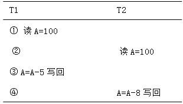
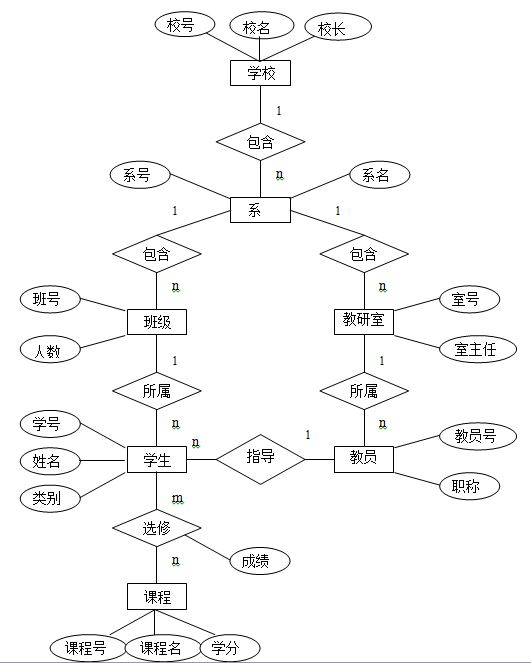
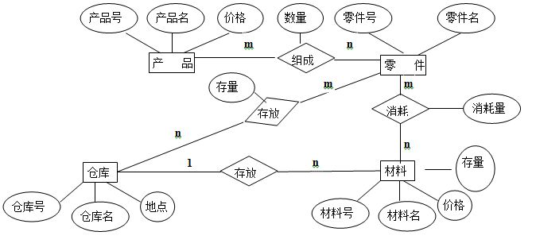

<!-- more -->

# 单选题

## 课堂习题  + PPT

1. 下列四项中,不属于数据库系统的特点的是(<font color='red'>C</font>)

   A、数据结构化

   B、数据由DBMS统一管理和控制

   C、数据冗余度大

   D、数据独立性高

2. 概念模型是现实世界的第一层抽象,这一类模型中最著名的模型是:(<font color='red'>D</font>)

   A、层次模型

   B、关系模型

   C、网状模型

   D、实体-联系模型

3. 数据的逻辑独立性是指:(<font color='red'>C</font>)

   A、内模式改变,模式不变

   B、模式改变,内模式不变

   C、模式改变,外模式和应用程序不变

   D、内模式改变,外模式和应用程序不变

4. 在数据库的三级模式结构中,描述数据库中全体数据的全局逻辑结构和特征的是:(<font color='red'>D</font>)

   A、外模式

   *B、*内模式

   C、存储模式

   D、模式

5. 要保证数据库的逻辑数据独立性,需要修改的是:(<font color='red'>A</font>)

   A、模式与外模式之间的映象

   B、模式与内模式之间的映象

   C、模式

   D、三级模式

6. 关系数据模型的基本数据结构是:(<font color='red'>D</font>)
   A、树
   B、图
   C、索引
   D、关系

7. DB、DBMS和DBS三者之间的关系是:(<font color='red'>B</font>)
   A、DB包括DBMS和DBS
   B、DBS包括DB和DBMS
   C、DBMS包括DB和DBS
   D、不能相互包括

8. 数据库系统与文件系统的主要区别是:(<font color='red'>B</font>)
   A、数据库系统复杂,而文件系统简单
   B、文件系统不能解决数据冗余和数据独立性问题,而数据库系统可以解决
   C、文件系统只能管理程序文件,而数据库系统能够管理各种类型的文件
   D、文件系统管理的数据量较少,而数据库系统可以管理庞大的数据量

9. 下述关于数据库系统的正确叙述是:(<font color='red'>A</font>)
   A、数据库系统减少了数据冗余
   B、数据库系统避免了一切冗余
   C、数据库系统中数据的一致性是指数据类型一致
   D、数据库系统比文件系统能管理更多的数据

10. 在数据管理技术的发展过程中,经历了人工阶段、文件系统阶段和数据库系统阶段。在这几个阶段中,数据独立性最高的(<font color='red'>A</font>)阶段。
    A、数据库系统
    B、文件系统
    C、人工管理
    D、数据项管理

11. 数据库的概念模型独立于:(<font color='red'>A</font>)
    A、具体的机器和DBMS
    B、E-R图
    C、信息世界
    D、现实世界

12. (<font color='red'>B</font>)是存储在计算机内有结构的数据的集合
    A、数据库系统
    B、数据库
    C、数据库管理系统
    D、数据结构

13. 数据库中存储的是:(<font color='red'>C</font>)

    A、数据

    B、数据模型

    C、数据及数据之间的联系

    D、信息

14. 数据库的基本特点是:(<font color='red'>B</font>)

    A、(1)数据可以共享(或数据结构化)(2)数据独立性(3)数据冗余大,易移植(4)统一管理和控制

    B、(1)数据可以共享(或数据结构化)(2)数据独立性(3)数据冗余小,易扩充(4)统一管理和控制

    C、(1)数据可以共享(或数据结构化)(2)数据互换性(3)数据冗余大,易移植(4)统一管理和控制

    D、(1)数据非结构化(2)数据独立性(3)数据冗余大,易移植(4)统一管理和控制

15. DBMS是:(<font color='red'>D</font>)

    A、数学软件

    B、应用软件

    C、计算机辅助设计

    D、系统软件

16. 层次型、网状型和关系型数据库划分的原则是:(<font color='red'>D</font>)

    A、记录长度

    B、文件的大小

    C、联系的复杂程度

    D、数据之间的联系

17. 层次模型不能直接表示:(<font color='red'>C</font>)

    A、1:1

    B、1:m

    C、m:n

    D、1:1和1:m关系

18. SQL语言具有(<font color='red'>B</font>)的功能。
    A、关系规范化、数据操纵、数据控制
    B、数据定义、数据操纵、数据控制
    C、数据定义、关系规范化、数据控制
    D、数据定义、关系规范化、数据操纵

19. SQL 语言通常称为(<font color='red'>A</font>)
    A、结构化查询语言
    B、结构化控制语言
    C、结构化定义语言
    D、结构化操纵语言

20. 为了使索引键的值在基本表中唯一,在建立索引的语句中应使用保留字(<font color='red'>A</font>)
    A、UNIQUE
    B、COUNT
    C、DISTINCT
    D、UNION

21. SQL 语言中,条件“年龄BETWEEN 20 AND 30”表示年龄在20至30之间,且(<font color='red'>A</font>)
    A、包括20岁和30岁
    B、不包括20岁和30岁
    C、包括20岁但不包括30岁
    D、包括30岁但不包括20岁

22. 要查询XSH 数据库CP 表中产品名称含有“冰箱”的产品情况,可用(<font color='red'>C</font>)命令。
    A、 SELECT * FROM CP WHERE 产品名称 LIKE ‘冰箱’
    B、SELECT * FROM XSH WHERE 产品名称 LIKE ‘冰箱’
    C、SELECT * FROM CP WHERE 产品名称 LIKE ‘%冰箱%’
    D、SELECT * FROM CP WHERE 产品名称=‘冰箱’

23. 用下面的T-SQL语句建立一个基本表:

    CEATE TABLE Student(Sno CHAR(4) PRIMARY KEY, name CHAR(8) NOT NULL, sex CHAR(2), age INT)

    能插入到表中的元组是(<font color='red'>D</font>)

    A、'5021','刘祥',男,21

    B、NULL,'刘祥',NULL,21

    C、'5021',NULL,男,21 

    D、'5021','刘祥',NULL,NULL

24. SQL语言中,删除一个表的命令是(<font color='red'>B</font>)

    A、DELETE

    B、DROP

    C、CLEAR

    D、REMOVE

25. 视图是一个“虚表”,视图的构造基于(<font color='red'>C</font>)

    A、基本表

    B、视图

    C、基本表或视图

    D、数据字典

26. 关系代数中的π运算符对应SELECT语句中的以下哪个子句?(<font color='red'>A</font>)

    A、SELECT

    B、FROM

    C、WHERE

    D、GROUP BY

27. 在SQL语言的SELECT语句中,用于对结果元组进行排序的是(<font color='red'>C</font>)子句。

    A、GROUP BY

    B、HAVING

    C、ORDER BY

    D、WHERE

28. 在SQL中,建立视图用的命令是(<font color='red'>A</font>)。

    A、CREATE VIEW

    B、CREATE SCHEMA

    C、CREATE TABLE

    D、CREATE INDEX

29. 已知学生关系(学号,姓名,年龄,班级),要检索班级为空值的学生姓名,其SQL查询语句中 WHERE子句的条件表达式是(B) 。

    A、班级=null

    B、班级 is null

30. 以下分组查询中正确的是(<font color='red'>A</font>)

    A、select agv(sage)， sex  from student  group  by sex

    B、select sage， sdept  from student  group  by  sdept

31. SQL语言不支持关系数据库三级模式结构(<font color='red'>B</font>)

    A、对

    B、错

32. 如果查询语句中有order by子句，那么order by子句(<font color='red'>A</font>)

    A、应放在所有语句的后面

    B、可以放在查询语句的任意位置

33. 集函数通常和（B）子句一起使用，其目的是细化集函数的作用范围

    A、order by

    B、group by

34. 分组后还可以按要求筛选，最终只输出满足条件的组，由(<font color='red'>B</font>)指定筛选条件

    A、where

    B、having

35. 把对关系SPJ的属性QTY的修改权授予用户李勇的T-SQL语句是(<font color='red'>C</font>)

    A、GRANT QTY ON SPJ TO '李勇'

    B、GRANT UPDATE(QTY) ON SPJ TO '李勇'

    C、GRANT UPDATE  ON SPJ(QTY) TO 李勇

    D、UPDATE ON SPJ (QTY) FROM 李勇

36. SQL的GRANT和REVOKE语句主要用来维护数据库的(<font color='red'>A</font>)。
    A、安全性
    B、完整性
    C、可靠性
    D、一致性

37. 在数据库的安全性控制中,为了保证用户只能存取他有权存取的数据。在授权的定义中,数据对象的(<font color='red'>A</font>),授权子系统就越灵活。
    A、范围越小
    B、范围越大
    C、约束越细致
    D、范围越适中

38. 保护数据库,防止未经授权的或不合法的使用造成的数据泄露、更改破坏。这是指数据的(<font color='red'>A</font>)
    A、安全性
    B、完整性
    C、并发控制
    D、恢复

39. 在数据库系统中,对存取权限的定义称为(<font color='red'>B</font>)

    A、命令

    B、授权

    C、定义

    D、审计

40. 数据库管理系统通常提供授权功能来控制不同用户访问数据的权限,这主要是为了实现数据库的(<font color='red'>A</font>)

    A、安全性

    B、完整性

    C、一致性

    D、可靠性

41. 下列SQl语句中,能够实现“收回用户ZHAO对学生表(STUO)中学号(XH)的修改权限”这一功能的是(<font color='red'>C</font>)。

    A、REVOKE UPDATE(XH) ON TABLE FROM ZHAO

    B、REVOKE UPDATE(XH) ON TABLE FROM PUBLIC

    C、REVOKE UPDATE ON STUD(XH) FROM ZHAO

    D、REVOKE UPDATE(XH) ON STUD FROM PUBLIC

42. 把对关系SC的属性GRADE的修改权授予用户ZHAO的SQL语句是(<font color='red'>C</font>)

    A、GRANT GRADE ON SC TO ZHAO

    B、GRANT UPDATE ON SC TO ZHAO

    C、GRANT UPDATE ON SC(GRADE) TO ZHAO

    D、GRANT UPDATE ON SC(GRADE) FROM ZHAO

43. 以下安全性控制方法中，位于最外层的是（<font color='red'>A</font>）。

    A、用户标识鉴定

    B、视图

    C、审计

    D、数据加密

44. 创建数据表时使用PRIMARY KEY可实现(<font color='red'>A</font>)。

    A、实体完整性

    B、参照完整性

    C、用户定义完整性

    D、域完整性

45. 数据库的(<font color='red'>B</font>)是指数据的正确性和相容性

    A、安全性

    B、完整性

    C、并发控制

    D、恢复

46. 关于主码的约束以下说法错误的是(<font color='red'>C</font>)

    A、一个表中只能设置一个主码

    B、允许空值的字段上不能定义主键约束

    C、允许空值的字段上可以定义主键约束

    D、可以将包含多个字段的字段组合设置为主键

47. 在数据库表的定义中,限制成绩属性列的取值在0到100的范围内,属于数据(<font color='red'>C</font>)

    A、实体完整性约束

    B、参照完整性约束

    C、用户自定义完整性约束

    D、用户操作
    
48. SQL语言有两种方式,分别称为交互式SQL和(<font color='red'>B</font>)。
    A、自含式SQL
    B、嵌入式SQL
    C、宿主式SQL
    D、批处理式SQL

49. SQL的集合处理方式与宿主语言单记录的处理方式之间用(<font color='red'>B</font>)来协调。
    A、SQLCA
    B、游标
    C、存储过程
    D、触发器

50. 在高级语言中使用嵌入式SQL语句时,所有SQL语句前必须加前缀(<font color='red'>C</font>)。
    A、CALL SQL
    B、DO SQL
    C、EXEC SQL
    D、GOTO SQL

51. 有关嵌入式SQL的叙述,不正确的是(<font color='red'>B</font>)。
    A、宿主语言是指C一类高级程序设计语言
    B、宿主语言是指SQL语言
    C、在程序中要区分SQL语句和宿主语言语句
    D、SQL有交互式和嵌入式两种使用方式

52. y当有σ和∞时，应当先做（<font color='red'>A</font>）。
    A、σ

    B、∞

53. 若f只涉及到E1的属性，则σf(E1×E2)≡（<font color='red'>A</font>）。

    A、σf(E1)×E2  

    B、σf1(E1)×σf2(E2)

    C、σf2(σf1(E1)×E2)

54. 关系代数表达式的优化策略中,首先要做的是(<font color='red'>C</font>)

    A、连接

    B、投影

    C、选择

    D、笛卡尔积

55. 事务的隔离性是指(<font color='red'>A</font>)。

    A、一个事务内部的操作及使用的数据对并发的其他事务是隔离的

    B、事务一旦提交,对数据库的改变是永久的

    C、事务中包括的所有操作要么都做,要么都不做

    D、事务必须是使数据库从一个一致性状态变到另一个一致性状态

56. 数据库恢复的基础是利用转储的冗余数据。这些转储的冗余数据是指(<font color='red'>C</font>)

    A、数据字典、应用程序、审计档案、数据库后备副本

    B、数据字典、应用程序、日志文件、审计档案

    C、日志文件、数据库后备副本

    D、数据字典、应用程序、数据库后备副本

57. 事务是数据库运行的基本单位。如果一个事务执行成功,则全部更新提交;如果一个事务执行失败,则已做过的更新被恢复原状,好像整个事务从未有过这些更新,这样保持了数据库处于(<font color='red'>B</font>)状态。

    A、安全性

    B、一致性

    C、隔离性

    D、可靠性

58. (<font color='red'>B</font>)用来记录对数据库中数据进行的每一次更新操作。

    A、后援副本

    B、日志文件

    C、数据库

    D、缓冲区

59. 若系统在运行过程中,由于某种硬件故障,使存储在外存上的数据部分损失或全部损失,这种情况称为(<font color='red'>C</font>)

    A、事务故障

    B、系统故障

    C、介质故障

    D、运行故障

60. 事务日志的用途是(<font color='red'>C</font>)

    A、事务处理

    B、完整性约束

    C、数据恢复

    D、安全性控制

61. 一个事务执行过程中,其正在访问的数据被其他事务所修改,导致处理结果不正确,这是由于违背了事务的(<font color='red'>A</font>)特性而引起的

    A、隔离性

    B、一致性

    C、原子性

    D、持久性

62. 日志文件是用于记录(<font color='red'>C</font>)。

    A、程序运行过程

    B、数据操作

    C、对数据的所有更新操作

    D、程序执行的结果

63. 事务的原子性是指(<font color='red'>A</font>)

    A、事务中包括的所有操作要么都做,要么都不做

    B、事务一旦提交,对数据库的改变是永久的

    C、一个事务内部的操作及使用的数据对并发的其他事务是隔离的

    D、事务必须是使数据库从一个一致性状态变到另一个一致性状态

64. 事务的一致性是指(<font color='red'>D</font>)。

    A、事务中包括的所有操作要么都做,要么都不做

    B、事务一旦提交,对数据库的改变是永久的

    C、一个事务内部的操作及使用的数据对并发的其他事务是隔离的

    D、事务必须是使数据库从一个一致性状态变到另一个一致性状态

65. 事务的持续性是指(<font color='red'>B</font>)

    A、事务中包括的所有操作要么都做,要么都不做

    B、事务一旦提交,对数据库的改变是永久的

    C、一个事务内部的操作及使用的数据对并发的其他事务是隔离的

    D、事务必须是使数据库从一个一致性状态变到另一个一致性状态

66. 若数据库中只包含成功事务提交的结果,则此数据库就称为处于(<font color='red'>B</font>)状态。

    A、安全

    B、 一致 

    C、不安全

    D、不一致

67. 若系统在运行过程中,由于某种原因,造成系统停止运行,致使事务在执行过程中以非控制方式终止,这时内存中的信息丢失,而存储在外存上的数据未受影响,这种情况称为(<font color='red'>B</font>)。

    A、事务故障

    B、系统故障

    C、介质故障

    D、运行故障

68. 为保证数据库是可恢复的，登记日志文件时，应（<font color='red'>B</font>）。

    A、必须先写数据库，后写日志文件

    B、必须先写日志文件，后写数据库

69. 若事务T对数据对象A加上S锁,则(<font color='red'>C</font>)。

    A、事务T可以读A和修改A,其它事务只能再对A加S锁,而不能加X 锁。

    B、事务T可以读A但不能修改A,其它事务能对A加S锁和X锁。

    C、事务T可以读A但不能修改A,其它事务只能再对A加S锁,而不能加X 锁。

    D、事务T可以读A和修改A,其它事务能对A加S锁和X锁。

70. 以下(<font color='red'>D</font>)封锁违反两段锁协议。

    A、Slock A … Slock B … Xlock C …… Unlock A … Unlock B … Unlock C

    B、Slock A … Slock B … Xlock C …… Unlock C … Unlock B … Unlock A

    C、Slock A … Slock B … Xlock C …… Unlock B … Unlock C … Unlock A

    D、Slock A …Unlock A ……Slock B … Xlock C ……Unlock B … Unlock C

71. 在并发控制技术中,最常用的是封锁机制,基本的封锁类型有排它锁X和共享锁S,下列关于两种锁的相容性描述不正确的是(<font color='red'>A</font>)

    A、X/X :TRUE

    B、S/S:TRUE

    C、S/X:FALSE

    D、X/S:FALSE

72. 封锁机制是实现数据库(<font color='red'>C</font>)主要方法。

    A、完整性

    B、安全性

    C、并发控制

    D、保护

73. 若事务T对数据R已经加X锁,则其他事务对数据R(<font color='red'>C</font>)

    A、可以加S锁不能加X锁

    B、不能加S锁可以加X锁

    C、可以加S锁也可以加X锁

    D、不能加任何锁

74. 关于“死锁”,下列说法正确的是(<font color='red'>D</font>)

    A、死锁是操作系统中的问题,数据库操作中不存在

    B、在数据库操作中防止死锁的方法是禁止两个用户同时操作数据库

    C、当两个用户竞争相同资源时不会发生死锁

    D、只有出现并发操作时,才有可能出现死锁

75. 对并发操作若不加以控制,可能会带来(<font color='red'>B</font>)问题。

    A、不安全

    B、不一致

    C、死机

76. 在数据库系统中死锁属于(<font color='red'>C</font>)

    A、系统故障

    B、程序故障

    C、事务故障

    D、介质故障

77. 设有两个事务T1、T2，其并发操作如图1示，下面评价正确的是（<font color='red'>B</font>）

    

    A、该操作不存在问题

    B、该操作丢失修改

    C、该操作不能重复读

    D、该操作读“脏”数据

78. （<font color='red'>A</font>）是并发事务正确性的准则。

    A、可串行性

    B、可并行性

79. 事务的（<font color='red'>B</font>）调度不会破坏DB的完整性,这个性质叫做事务的隔离性。
    A.串行

    B.并行

80. 并发操作会带来哪些不一致性(<font color='red'>D</font>)。

    A.丢失修改、不可重复读、读脏数据、死锁

    B.不可重复读、读脏数据、死锁

    C.丢失修改、读脏数据、死锁

    D.丢失修改、不可重复读、读脏数据

81. 事务的持久性是指(<font color='red'>B</font>)。

    A.一个事务内部的操作及使用的数据对并发的其他事务是隔离的

    B.事务一旦提交,对数据库的改变是永久的

    C.事务中包括的所有操作要么都做,要么都不做

    D.事务必须是使数据库从一个一致性状态变到另一个一致性状态

82. 在数据库的概念设计中,最常用的数据模型时(<font color='red'>D</font>)

    A.形象模型

    B.物理模型

    C.逻辑模型

    D.实体联系模型

83. E-R模型中用（<font color='red'>A</font>）表示联系

    A.菱形

    B.矩形

84. 数据库设计的概念结构设计阶段,表示概念结构的常用方法和描述工具是(<font color='red'>B</font>)。

    A.数据流程分析法和数据流图

    B.实体-联系方法和E-R图

    C.结构分析法和模块结构图

    D.层次分析法和层次结构图

85. 在数据库设计中,用E-R图来描述信息结构但不涉及信息在计算机中的表示,它是数据库设计的(<font color='red'>B</font>)阶段。

    A.需求分析

    B.概念设计

    C.逻辑设计

    D.物理设计

86. 在关系数据库设计中,设计关系模式是数据库设计中(<font color='red'>A</font>)阶段的任务

    A.逻辑设计

    B.物理设计

    C.需求分析

    D.概念设计

87. 从E-R模型关系向关系模型转换时,一个m:n联系转换为关系模型时,该关系模式的主码是(<font color='red'>C</font>)

    A.M端实体的主码

    B.N端实体的主码

    C.M端实体主码与N端实体主码组合

    D.重新选取其他属性

88. R(sno, cno, grade, tname, taddr)，每门课程只有一个老师上

     FD:（sno,cno)→grade， cno→tname，   tname→taddr

    以上关系模式最高到几范式？(<font color='red'>A</font>)

    A.1NF

    B.2NF

    C.3NF

    D.BCNF

89. 根据关系数据库规范化理论,关系DB中的关系要求满足1NF,下面“部门”关系中,因哪个属性而使得它不满足1NF(<font color='red'>B</font>)

    (部门号,部门名,部门成员,部门总经理)

    A.部门总经理

    B.部门成员

    C.部门名

    D.部门号

90. 以下哪个是平凡函数依赖(<font color='red'>A</font>)

    A.(sno, pno, jno)--->sno

    B.(sno, pno, jno)--->qty

91. create table中用(<font color='red'>B</font>)定义外码？

    A.primary key

    B.foreign key

92. 创建数据表时使用PRIMARY KEY可实现(<font color='red'>A</font>)。

    A.实体完整性

    B.参照完整性

    C.用户定义完整性

    D.域完整性

93. 数据库的完整性是指数据的()和()。 (<font color='red'>A</font>)

    (1)正确性 (2)合法性 (3)不被非法存取 (4)相容性 (5)不被恶意破坏

    A.(1)和(4)

    B.(1)和(3)

    C.(2)和(5)

    D.(2)和(4)

94. 创建视图的语句如下：(<font color='red'>B</font>)

    create view IS_STUDENT

    as select sno, sname, sage, sdept

    from student

    where sdept='计算机'

    with check option

    针对该视图的更新操作

    update is_student

    set sdept='信息'

    where sno='01005'

    A.可以完成

    B.不可以完成

95. 针对视图 （<font color='red'>A</font>）

    create view S_G(sno, gavg)

    as select sno, avg(grade)

    from sc

    group by sno

    的哪个操作可以执行

    A.select * from S_G where gavg>80

    B.update s_g set gavg='70' where sno='01001'

96. 能将01002的院系至为空值的更新语句是(<font color='red'>A</font>)

    A.update st set sdept=null where sno='01002'

    B.update st set sdept is null where sno='01002'

97. 凡是遇到“包含”、“全部”等查询条件时，应首先考虑什么运算？(<font color='red'>B</font>)

    A.交

    B.除法

    C.选择

    D.投影

98. 自然连接是构成新关系的有效方法。一般情况下,当对关系R和S使用自然连接时,要求R和S含有一个或多个共有的:(<font color='red'>D</font>)

    A.元组

    B.行

    C.记录

    D.属性

99. 在关系代数中,对一个关系做投影操作后,新关系的元组个数(<font color='red'>B</font>)原来关系的元组个数。

    A.小于

    B.小于或等于

    C.等于

    D.大于

100. 在关系代数中,从两个关系的笛卡尔积中选取它们属性间满足一定条件的元组的操作,称为:(<font color='red'>D</font>)

     A.并

     B.选择

     C.自然连接

     D.θ连接

101. 层次模型的基本数据结构是(<font color='red'>A</font>)

     A.树

     B.网

102. 已知关系R和S,R∩S等价于:(<font color='red'>B</font>)
     A、(R-S)-S
     B、S-(S-R)
     C、(S-R)-R
     D、S-(R-S)

103. 学校数据库中有学生和宿舍两个关系:学生(学号,姓名)和 宿舍(楼名,房间号,床位号,学号)，有的学生不住宿,床位也可能空闲。如果要列出所有学生住宿和宿舍分配的情况,包括没有住宿的学生和空闲的床位,则应执行(<font color='red'>C</font>)

     A、右外联接

     B、自然联接

     C、全外联接

     D、左外联接

104. 下列关系运算中,(<font color='red'>C</font>)运算不属于专门的关系运算。
     A、选择
     B、连接
     C、广义笛卡尔积
     D、投影

105. 有一个关系:学生(学号,姓名,系别),规定学号的值域是8个数字组成的字符串,这一规则属于:(<font color='red'>C</font>)
     A、实体完整性约束
     B、参照完整性约束
     C、用户自定义完整性约束
     D、关键字完整性约束

106. 五种基本关系代数运算是:(<font color='red'>A</font>)
     A、并、差、笛卡尔积、投影、选择
     B、并、差、连接、投影、选择
     C、并、交、笛卡尔积、投影、选择
     D、并、交、连接、投影、选择

107. 关系数据库管理系统应能实现专门的关系运算包括:(<font color='red'>B</font>)

     A、排序、索引、统计

     B、选择、投影、连接

     C、关联、更新、排序

     D、显示、打印、制表

------

# 多选题

## 课堂习题 + PPT

1. 数据管理经历了(<font color='red'>A</font>)、(<font color='red'>B</font>)和 (<font color='red'>C</font>)三个阶段。

   A、人工管理

   B、文件系统

   C、数据库系统

2. 关系数据模型由(<font color='red'>A</font>)、(<font color='red'>B</font>)和 (<font color='red'>D</font>)三部分组成。

   A、数据结构

   B、数据操作

   C、数据语义

   D、数据约束条件

3. 数据库系统的三级模式结构是指数据库系统由（<font color='red'>A</font>）、（<font color='red'>B</font>）和（<font color='red'>C</font>）三级构成。

   A、外模式

   B、逻辑模式

   C、内模式

   D、混合模式
   
4. 关系模式分解的等价性标准有两个,分别为分解具有(<font color='red'>A</font>)和(<font color='red'>D</font>)。

   A.无损连接性

   B.保持依赖性

   C.一致性

   D.完整性

5. 以下哪五种运算是基本运算(<font color='red'>BCDEF</font>)

   A.交

   B.差

   C.并

   D.笛卡尔积

   E.选择

   F.投影

   G.连接

   H.除

6. 以下哪些是专门的关系运算(<font color='red'>ABCD</font>)

   A.选择

   B.投影

   C.连接

   D.除

   E.并

   F.交

   G.差

   H.笛卡尔积

------

# 填空题

## 课堂习题+PPT

1. 在数据库中,只存放视图的(<font color='red'>定义</font>),不存放视图对应的数据。
2. 在SELECT语句查询中,要去掉查询结果中的重复记录,应该使用(<font color='red'>DISTINCT</font>)关键字。
3. SQL语言中,删除基本表的语句是(<font color='red'>Drop</font>),删除数据的语句是(<font color='red'>DELETE</font>)。
4. 在DBMS的授权子系统中,授权和回收权限的语句分别是(<font color='red'>GRANT</font>)和<font color='red'>REVOKE</font>语句。
5. 一个SQL语句原则上可产生或处理一组记录,而程序语言一次只能处理一个记录,为此必须协调两种处理方式,这是通过使用(<font color='red'>游标</font>)机制来解决的。
6. 存在一个等待事务集{T0,T1,…,Tn},其中T0正等待被T1锁住的数据项,T1正等待被T2锁住的数据项,Tn-1正等待被Tn锁住的数据项,且Tn正等待被T0锁住的数据项,这种情形称为(<font color='red'>死锁</font>)。
7. (<font color='red'>事物</font>)是恢复和并发控制的基本单位。
8. 一般情况,当对关系R和S使用自然连接时,要求R和S含有一个或多个共有的(<font color='red'>属性</font>)。
9. 关系数据库的实体完整性规则规定基本关系的(<font color='red'>主属性</font>)都不能取(<font color='red'>空值</font>) 。
10. 在关系A(S,SN,D)和B(D,CN,NM)中,A的主码是S,B的主码是D,则D在A中称为(<font color='red'>外码</font>)。
11. 设有学生表S(学号,姓名,班级)和学生选课表SC(学号,课程号,成绩),为维护数据一致性,表S与SC之间应满足(<font color='red'>参照</font>)完整性约束。
12. 根据参照完整性规则,外码的值或者等于以此码为主码的关系中某个元组主码的值,或者取(<font color='red'>空值</font>)。

------

# 判断题

## 课堂习题+PPT

1. DB、DBMS、DBS三者之间的关系是DBS包括DB和DBMS。(<font color='red'>√</font>)
2. 数据库的概念结构与支持其的DB的DBMS有关。(<font color='red'>×</font>)
3. 数据库系统中最重要的软件是DBMS。(<font color='red'>√</font>)
4. 数据库系统中最重要的人是DBA。(<font color='red'>√</font>)
5. 若R.A→R.B，R.B→R.C，则R.A→R.C。(<font color='red'>√</font>)
6. 若R.A→R.B，R.A→R.C，则R.A→R.(B,C)。(<font color='red'>√</font>)
7. 若R.B→R.A，R.C→R.A，则R.(B，C)→R.A。(<font color='red'>√</font>)
8. sF(pA1,A2,...,An(E)) = pA1,A2,...,An(sF(E))成立的条件是：F中的属性全部在A1 ,… ,An中。(<font color='red'>√</font>)
9. 选择操作的启发式规则，对于小关系应采用全表扫描。(<font color='red'>√</font>)
10. 封锁粒度越大,可以同时进行的并发操作越大,系统的并发程度越高。(<font color='red'>×</font>)
11. 规范化的投影分解是唯一的。(<font color='red'>×</font>)
12. 由X→Y，WY→Z，有WX→Z (<font color='red'>√</font>)
13. 设关系模式R(U,F)，ρ=（R1,R2…,Rk）是R的一个分解。如果对于R的任一满足F的关系r，把r在ρ上的投影的联接表达式记为： mρ(r)＝πR1(r)∞πR2(r)∞…∞πRk(r) 如果r＝mρ(r)成立，则称这个分解ρ是满足依赖集F的无损联接分解。(<font color='red'>√</font>)
14. 在R（U）中，K属于U，若K能函数确定U，则K为R（U）的候选码。(<font color='red'>√</font>)
15. 查询∏sno,sname（σcno !=“c2”(SC)∞S)返回的结果是没有选修“C4”这门课的学生的学号和姓名。(<font color='red'>×</font>)

------

# 简答题

## 课堂习题+PPT

SPJ数据库表格:

|   S(供应商表)   | SNO(供应商代码)   | SNAME(供应商姓名) | STATUS(供应商状态) | CITY(供应商所在城市) |
| :-------------: | ----------------- | ----------------- | ------------------ | -------------------- |
|    P(零件表)    | PNO(零件代码)     | PNAME(零件名)     | COLOR(颜色)        | WEIGHT(重量)         |
|    J(工程表)    | JNO(工程项目代码) | JNAME(项目名称)   | CITY(工程所在城市) |                      |
| SPJ(供应情况表) | SNO(供应商代码)   | PNO(零件代码)     | JNO(项目代码)      | QTY(供应数量)        |

1. 试述等值连接与自然连接的区别和联系。

   答:1.<font color='red'>连接运算符是“=”的连接运算称为等值连接。它是从关系R与S的广义笛卡尔积中选取A，B属性值相等的那些元组</font>

   2.<font color='red'>自然连接是一种特殊的等值连接，它要求两个关系中进行比较的分量必须是相同的属性组，并且在结果中把重复的属性列去掉。</font>

2. 关系代数的基本运算有哪些? 如何用这些基本运算来表示其他运算? 

   答:<font color='red'>并、差、笛卡尔积、投影和选择5种运算为基本的运算。其他3种运算，即交、连接和除，均可以用这5种基本运算来表达。</font>

   <font color='red'>R∩S=R－(R－S)</font>

   <font color='red'>R∞S=σAθB (R×S)</font>

   <font color='red'> AθB</font>

   <font color='red'>R∞S=π (σAθB (R×S))</font>

   <font color='red'>R÷S=πx(R)－πx((πx(R)×πy(S)－R))</font>

3. 设有一个SPJ数据库，包括S，P，J，SPJ四个关系模式，用关系代数完成查询。

   1. 求供应工程J1零件的供应商号码SNO：

      答:`SELECT SNO FROM SPJ WHERE JNO='J1'`

      <font color='red'>πSno(σJno=‘J1’（SPJ）)</font>

   2. 求供应工程J1零件P1的供应商号码SNO：

      答:`SELECT SNO FROM SPJ WHERE JNO='J1' AND PNO='P1'`

      <font color='red'>πSno(σJno=‘J1’∧Pno=‘P1‘(SPJ))</font>

   3. 求供应工程J1零件为红色的供应商号码SNO：

      答:`SELECT SNO FROM SPJ,P WHERE COLOR='红' AND JNO='J1'` or

      `SELECT SNO FROM SPJ WHERE JNO = 'J1' AND PNO IN (SELECT PNO FROM P WHERE COLOR = '红')`

      <font color='red'>πSno(σJno=‘J1’(σCOLOR=‘红’(P)∞SPJ))</font>

   4. 求没有使用天津供应商生产的红色零件的工程号JNO：

      ```sql
   SELECT JNO FROM J WHERE JNO NOT IN 
      (SELECT JNO FROM S,P,SPJ WHERE S.SNO = SPJ.SNO AND P.PNO = SPJ.PNO 
      AND S.CITY = '天津' AND P.COLOR = '红')
      ```
   
      答:<font color='red'>πJno(J)- πJno(σcity=‘天津’∧Color=‘红’(S∞SPJ∞P))</font>
   
   5. 求至少用了供应商S1所供应的全部零件的工程号JNO：
   
      答:<font color='red'>πJno,Pno(SPJ) ÷ πPno(σSNO = 'S1' (SPJ))</font>
   
4. 下面的结论是否正确?如果正确，请给出证明，如果错误请给出一个反例。

   任何一个二目关系是属于3NF。

   答:<font color='red'>正确。因为关系模式中只有两个属性，所以无传递依赖，所以属于3NF。</font>

5. 下面的结论是否正确?如果正确，请给出证明，如果错误请给出一个反例。

   任何一个二目关系是属于BCNF

   答:<font color='red'>正确。按BCNF的定义，若XàY,且Y不是X的子集时，每个决定因素都包含码，对于二目关系决定因素必然包含码。</font>

   <font color='red'>证明：设R为一个二目关系R(A1，A2)，则属性A1和A2之间可能存在以下几种依赖关系：</font>

   <font color='red'>A、A1决定A2，但A2不决定A1，则关系R的码为A1，决定因素都包含码，所以，R是BCNF。</font>

   <font color='red'>B、A1不决定A2，A2决定A1，则关系R的码为A2，所以决定因素都包含码，R是BCNF。</font>

   <font color='red'>C、R的码为(A1，A2)（即A1 ->A2，A2 ->A1），决定因素都包含码。R是BCNF。</font>

6. 下面的结论是否正确?如果正确，请给出证明，如果错误请给出一个反例。

   若R.(B，C)→R.A，则R.B→R.A，R.C→R.A。

   答:<font color='red'>不正确。反例如下：(sno,cno)→grade，但是sno→grade 和cno→grade不成立。</font>

7. 请为三建工程项目建立一个供应情况的视图，包括供应商代码(SNO)、零件代码(PNO)、供应数量(QTY)。针对该视图VSP完成下列查询：

   （1）找出三建工程项目使用的各种零件代码(PNO)及其数量(QTY)

   （2）找出供应商S1的供应情况

   答: <font color='red'>①创建视图</font>

   ```sql
   CREATE VIEW VSP
   AS
   SELECT SNO,PNO,QTY FROM J,SPJ
   WHERE SPJ.JNO = J.JNO AND J.JNAME = '三建'
   ```

   <font color='red'>②找出三建工程项目使用的各种零件代码(PNO)及其数量(QTY)</font>

   ```sql
   SELECT PNO,QTY FROM VSP
   ```

   <font color='red'>③找出供应商S1的供应情况</font>

   ```sql
   SELECT * FROM VSP WHERE SNO = 'S1'
   ```

8. 针对论述题中的四个表试用SQL完成以下各项操作：

   (1)找出所有供应商的姓名和所在城市。

   ```sql
   SELECT SNAME,CITY FROM S
   ```

   (2)找出所有零件的名称、颜色、重量。

   ```sql
   SELECT PNAME,COLOR,WEIGHT FROM P
   ```

   (3)找出使用供应商S1所供应零件的工程号码。

   ```sql
   SELECT DISTINCT JNO FROM SPJ WHERE SNO = 'S1'
   ```

   (4)找出工程项目J2使用的各种零件的名称及其数量。

   ```SQL
   SELECT PNAME,QTY FROM P,SPJ WHERE P.PNO = SPJ.PNO AND SPJ.JNO = 'J2'
   ```

   (5)找出上海厂商供应的所有零件号码。

   ```SQL
   SELECT DISTINCT PNO FROM S,SPJ WHERE S.SNO = SPJ.SNO AND CITY = '上海'
   ```

   (6) 找出使用上海产的零件的工程名称。

   ```sql
   SELECT JNAME FROM S,J,SPJ
   WHERE S.SNO = SPJ.SNO AND J.JNO = SPJ.JNO
   AND S.CITY = '上海'
   /*
   或者
   */
   SELECT JNAME FROM J WHERE JNO IN
   (SELECT JNO FROM SPJ,S WHERE SPJ.SNO=S.SNO AND CITY='上海')
   ```

   (7)找出没有使用天津产的零件的工程号码。

   ```SQL
   SELECT JNO FROM J WHERE JNO NOT IN
   (SELECT JNO FROM S,SPJ WHERE S.SNO = SPJ.SNO AND CIYT = '天津')
   ```

   (8)把全部红色零件的颜色改成蓝色。

   ```sql
   UPDATE P SET COLOR = '蓝色' WHERE COLOR = '红色'
   ```

   (9)由S5供给J4的零件P6改为由S3供应。

   ```SQL
   UPDATE SPJ SET SNO = 'S3' WHERE SNO = 'S5' AND JNO = 'J4' AND SNO = 'P6'
   ```

   (10)从供应商关系中删除供应商号是S2的记录，并从供应情况关系中删除相应的记录。

   ```SQL
   DELETE FROM S WHERE SNO = 'S2'
   DELETE FROM SPJ WHERE SNO = 'S2'
   ```

   (11)请将(S2，J6，P4，200)插入供应情况关系。

   ```SQL
   INSERT INTO SPJ
   VALUES('S2','J6','P4',200)
   /*
   或者
   */
   INSERT INTO SPJ(SNO, JNO, PNO, QTY) 
   VALUES('S2','J6','P4',200)
   ```

9. 今有以下两个关系模式：

   职工（职工号，姓名，年龄，职务，工资，部门号）

   部门（部门号，姓名，经理名，地址，电话号）

   请用SQL的GRANT和REVOKE语句完成以下授权定义或存取控制功能。

   （1）用户刘星对职工表有SELECT权限，对工资字段具有更改权限。

   ```sql
   GRANT SELECT, UPDATE(工资) ON 职工 TO 刘星
   ```

   （2）撤销用户刘星对职工表的SELECT权限，对工资字段的更改权限。

   ```sql
   REVOKE SELECT,UPDATE ON 职工 FROM 刘星
   ```

10. 今有以下两个关系模式：

    职工（职工号，姓名，年龄，职务，工资，部门号）

    部门（部门号，姓名，经理名，地址，电话号）

    请用SQL的GRANT和REVOKE语句（加上视图机制）完成以下授权定义或存取控制功能：用户杨兰具有从每个部门职工中SELECT最高工资、最低工资、平均工资的权限，他不能查看每个人的工资。

    ```sql
    CREATE VIEW STA_SAL(最高工资,最低工资,平均工资,部门号)
    AS
    SELECT MAX(工资),Min(工资),AVG(工资),部门号
    FROM 职工
    GROUP BY 部门号
    
    GRANT SELECT ON STA_SAL TO 杨兰
    REVOKE SELECT ON STA_SAL FROM 杨兰
    ```

11. 写出关系模式R（C，T，H，R，S，G）F={C→T，HR→C，HT→R，HS→R，CS→G}的全部候选码，判断该关系模式最高为几范式，解释原因。若未达到3NF，请进行既无损又保持FD的3NF分解。

    答:<font color='red'>①候选码:HS</font>

    <font color='red'>②最高范式:2NF 因为存在非主属性对码的传递函数依赖</font>

    <font color='red'>③分解为:ρ={CT,HRC,HTR,HSR,CSG}</font>

12. 写出关系模式R（A,B,C,D,E,G） F={B→G,CE→B,C→A,B→D,C→D}

    的全部候选码，判断该关系模式最高为几范式，解释原因。若未达到3NF，请进行既无损又保持FD的3NF分解。

    答:<font color='red'>①候选码:CE</font>

    <font color='red'>②最高范式:1NF 因为存在非主属性对码的部分函数依赖</font>

    <font color='red'>③分解为:ρ={BGD,CEB,CAD}</font>

13. 学校中有若干系，每个系有若干班级和教研室，每个教研室有若干教员，其中由的教授和副教授每人带若干研究生，每个班有若干学生，每个学生选修若干课程，每门课可由若干学生选修。根据E-R图给出其逻辑设计，标识出每个关系模式的主码，如果有外码也请标识出。

    注：

    1． 分清实体和联系及它们的表示方法

    2． 画出实体和联系主要属性

    3． 分清联系的类型（m：n）

    4． 区分多个（3个以上）实体之间的联系

    5． 实体合并
    答:<font color='red'>①ER图</font>

    

    <font color='red'>②关系模式</font>

    <font color='red'>学校(<u>学校号</u>，学校名，校长)</font>

    <font color='red'>系(<u>系号</u>，系名，学校号) 学校号是外码</font>

    <font color='red'>班级(<u>班号</u>，人数，系号) 系号是外码</font>

    <font color='red'>教研室(<u>室号</u>，室主任，系号) 系号是外码</font>

    <font color='red'>学生(<u>学号</u>，姓名，类别，班号，教员号) 班号和教员号是外码</font>

    <font color='red'>教员(<u>教员号</u>，职称，室号) 室号是外码</font>

    <font color='red'>课程(<u>课程号</u>，课程名，学分)</font>

    <font color='red'>选修(<u>课程号，学号</u>，成绩) 学号课程号都是外码</font>

    <font color='red'>各关系模式下划线属性是主码</font>

14. 某工厂生产若干产品，每种产品由不同的零件组成，有的零件可用在不同的产品上。这些零件由不同的原材料制成，不同零件所用的材料可用相同。这些零件按所属的不同产品分别放在仓库中，原材料按照类别放在若干仓库中。请用E-R图画出此工厂产品、零件、材料、仓库的概念模型。根据E-R图给出其逻辑设计，标识出每个关系模式的主码，如果有外码也请标识出。

    注：

    1． 分清实体和联系及它们的表示方法

    2． 画出实体和联系主要属性

    3． 分清联系的类型（m：n）

    4． 区分多个（3个以上）实体之间的联系

    5． 实体合并

    答:<font color='red'>①ER图</font>

    

    <font color='red'>②关系模式</font>

    <font color='red'>产品(<u>产品号</u>，产品名，价格)</font>

    <font color='red'>零件(<u>零件号</u>，零件名)</font>

    <font color='red'>材料(<u>材料号</u>，材料名，价格，存量，仓库号) 仓库号是外码</font>

    <font color='red'>仓库(<u>仓库号</u>，仓库名，地点)</font>

    <font color='red'>组成(<u>产品号，零件号</u>，数量) 产品号和零件号是外码</font>

    <font color='red'>消耗(<u>零件号，材料号</u>，消耗量) 零件号和材料号是外码</font>

    <font color='red'>存放(<u>零件号，仓库号</u>，存量) 零件号和仓库号是外码</font>

    <font color='red'>各关系模式下划线属性是主码</font>